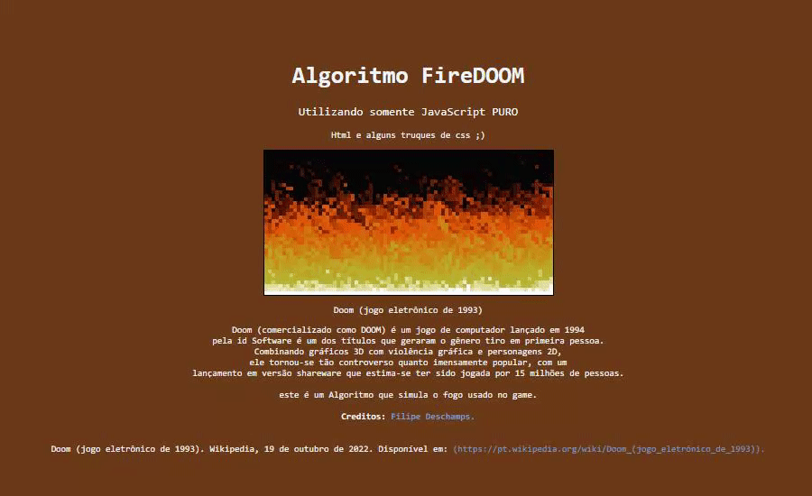

# FireDoom

  

## Descrição
Algoritmo replicado por mim com intuito de treinar programação funcional utilizando JavaScript puro, e também testar os conhecimentos em Html 5 e Css3.
Este algoritmo foi criado pelos desenvolvedores do jogo DOOM de 1993, e replicado pelo youtuber Filipe Deschamps, onde aprendi o algoritmo entendendo
como foi criado e aplicando na pratica, afim de testar meus conhecimentos. 

Este algoritmo foi replicado por mim a nivel didatico.
  
## Como executar ?

1° Baixe o repositorio 
  
2° execute o arquivo index.html no seu navegador (Dê preferencia para navegadores mais atuais, Ex: Chrome, OperaGx, Mozila, Microsoft Edge).
